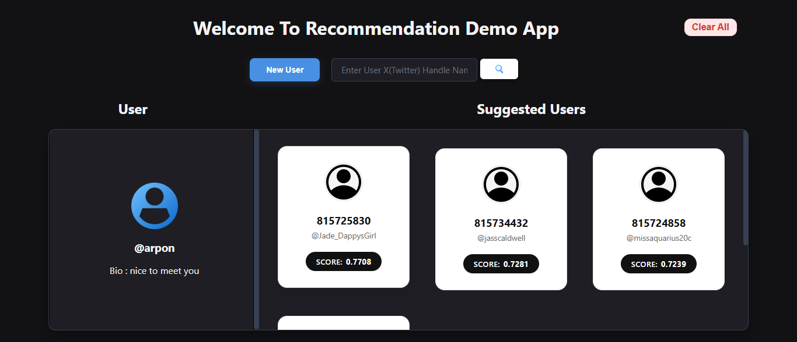
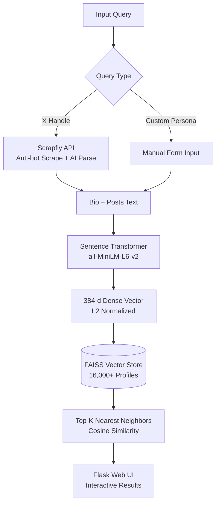

# 🎯 AI-Powered User Recommendation System


## ⚡ Overview

A content-based recommendation system that matches users by **semantic profile similarity** rather than exact keywords. It encodes user bios and posts into 384-dimensional dense vectors, performs high-speed cosine similarity retrieval using **FAISS**, and displays ranked recommendations through a modern web UI.

---

## 🚀 Key Features

- 🧠 **Contextual Embeddings**: Uses `all-MiniLM-L6-v2` transformer model for nuanced semantic representations.
- ⚡ **Ultra-Fast Similarity Search**: FAISS `IndexFlatIP` (Inner Product) for sub-millisecond retrieval.
- 🌐 **Live X Profile Scraping**: Extracts handle, bio, and recent tweets on-the-fly using Scrapfly's anti-bot AI extraction.
- ✍️ **Custom Persona Query**: Interactive modal to test recommendations with custom bios and names.
- 🎨 **Modern Dashboard**: Responsive cards, similarity score badges, and detailed profile modal inspector.

---

## Output


---

## 🏗️ Architecture & Workflow




---

## 🛠️ Tech Stack

| Layer | Tool / Library | Role |
|---|---|---|
| **Embeddings** | `sentence-transformers` (`all-MiniLM-L6-v2`) | Text-to-vector embedding generation (384-d) |
| **Vector Store** | `faiss-cpu` (`IndexFlatIP`) | L2-normalized inner product (cosine similarity) |
| **Web Scraping** | `scrapfly-sdk` | Headless rendering & AI extraction for X profiles |
| **Backend** | `Flask`, `Pandas`, `NumPy` | REST API, metadata indexing, and query processing |
| **Frontend** | `HTML5`, `CSS3`, `Vanilla JavaScript` | Responsive card grid, search bar, and inspection modals |


---

## ⚙️ Quick Start

### 1. Setup Virtual Environment

```bash
# Windows
python -m venv .venv
.venv\Scripts\activate

# Linux / macOS
python3 -m venv .venv
source .venv/bin/activate
```

### 2. Install Dependencies

```bash
pip install -r requirements.txt
```

### 3. Configure API Key

Create a `.env` file in the project root:

```env
API_KEY=your_scrapfly_api_key
```

### 4. Run the Web App

```bash
cd Frontend
python -m flask --app app.py run --debug
```

Access the dashboard at:
👉 **`http://127.0.0.1:5000`**

---

## 🔍 How It Works

1. **Text Assembly**: Combines user bio and post text:
   $$\text{Combined Text} = \text{"Bio: "} + \text{bio} + \text{" | Post: "} + \text{posts}$$
2. **Embedding**: Transforms text into a 384-dimensional vector via `all-MiniLM-L6-v2`.
3. **L2 Normalization**: Normalizes vectors to unit length so Inner Product directly calculates Cosine Similarity:
   $$\text{Similarity}(\mathbf{u}, \mathbf{v}) = \frac{\mathbf{u} \cdot \mathbf{v}}{\|\mathbf{u}\|_2 \|\mathbf{v}\|_2}$$
4. **Nearest Neighbor Search**: FAISS scans the indexed vectors and returns the top matches with highest scores.

---

## 💡 Engineering Considerations

- **Granularity Mismatch**: Multiple tweets from the same user can crowd top recommendations.
  - *Mitigation*: Group and aggregate tweets by user prior to vectorization or apply diversity filtering.
- **Billion-Scale Scaling**: Flat linear search ($\mathcal{O}(N)$) becomes costly at scale.
  - *Solution*: Transition to hierarchical or cluster indexing (e.g., `FAISS IVF-PQ` or `HNSW`) for sub-linear search.

---

## 👥 Authors

- **Krishna Kuila** - Data manupulation (ETL), Pipeline Architecture & Testing
- **Prateek Ranjan Mishra** - Recommendation Engine 
- **Arpon Kola** - Frontend Interface & Integration
- **Prasanta Adak** - Docs & Integration
- **Sukanta Samanta** - Docs & Frontend